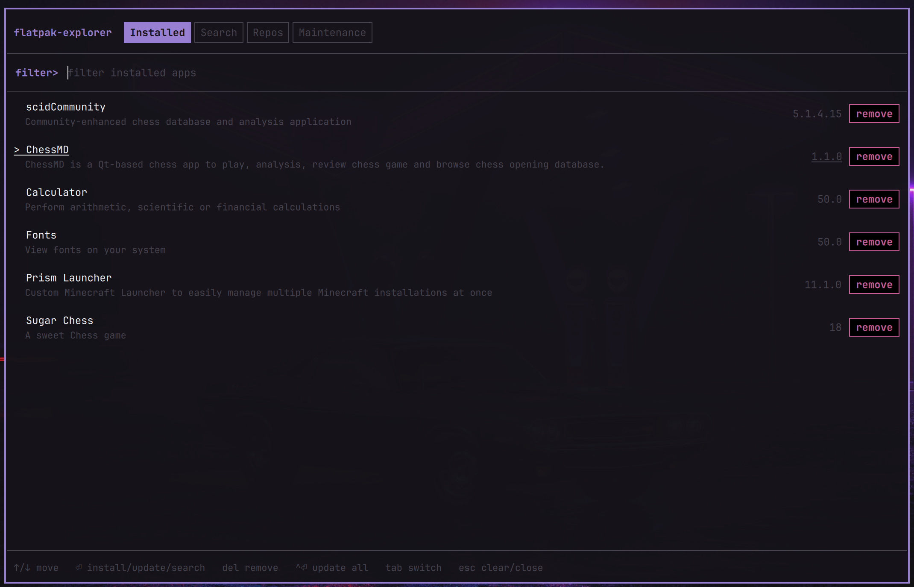

# Flatpak Explorer

A terminal-styled package manager for [Flatpak](https://flatpak.org/), built
as a [Quickshell](https://quickshell.org/) app. Browse and search Flathub,
install/remove/update apps, and manage your configured repositories.

It runs two ways from the same code: as a normal standalone window on any
Hyprland (or other wlroots) desktop with Quickshell installed, or as an
Omarchy shell plugin with native theme integration.



## Features

- **Installed apps**
- **Search Repository**
- **Update individually or all at once**
- **Remove apps**
- **Manage repositories** 
- **Maintenance tab** — remove unused runtimes, repair a corrupted
  installation, and see disk usage for both installations

## Omarchy only Features
- **A bar icon, as an Omarchy plugin** — always visible, swaps to a purple
  refresh glyph whenever a Flatpak update is pending, click to open the
  window. 

## Keybindings

It's driven from the keyboard, but everything is reachable with the mouse too.
Click a tab to switch to it, click (or just hover) a row to select it, and
click any action button to run it. A button that's asking for confirmation
(`y, remove?`) confirms when you click it again.

| Key | Action |
|---|---|
| `Tab` / `Shift+Tab` | next / previous tab |
| `↑` `↓` | move the selection (Installed, Search, Repos) |
| `←` `→` | move the selection on Maintenance — its actions are cards, not rows |
| `Ctrl+P` / `Ctrl+N` | move the selection, on any tab |
| `Enter` | see below — it depends on the tab |
| `Ctrl+Enter` | update everything (asks first) |
| `Delete` | remove the selected app or repo (asks first) |
| `Esc` | clear the input line, or close the window if it's already empty |
| anything else | types into the input line: filter, search query, or wizard field |

**What `Enter` does**, per tab:

- **Installed** — updates the selected app, if an update is pending for it.
- **Search** — runs the query if you haven't searched it yet; otherwise acts on
  the selected result (installs it, or updates it if it's already installed).
  Search is *only* ever sent when you press Enter — never as you type — so it's
  one deliberate network call, not one per keystroke.
- **Maintenance** — runs the selected action.
- **Repos** — nothing; use the keys below.

**On the Repos tab:**

| Key | Action |
|---|---|
| `a` | add a repository — a three-step prompt: name, then url, then scope |
| `e` or `Space` | enable / disable the selected repository |
| `Delete` | remove the selected repository (asks first) |

Inside the add-repository prompt, `Enter` moves to the next step and `Esc`
cancels the whole thing. At the last step, `u` (or just `Enter`) adds it for
your user, `s` adds it system-wide — which needs a polkit authorization.

**When something asks for confirmation**, `←`/`→`/`Tab` switch between Cancel
and Confirm, `Enter` runs whichever is selected, and `Esc` cancels. It always
opens on **Cancel**, and there's deliberately no `y` shortcut — a single
keystroke should never be able to uninstall something by accident.

**When a search result is available from more than one repository**, you'll be
asked which to install from: press `1`–`9` to pick, `Esc` to cancel.

**While an action is running** the window is blocked and shows the live
`flatpak` output; every key is ignored until it finishes. The output popup that
some maintenance actions leave behind closes with `Enter` or `Esc`.

## Install

### Standalone (any Hyprland / wlroots desktop)

```bash
git clone git@github.com:fireantology/flatpak-explorer.git
quickshell -p flatpak-explorer
```

`shell.qml` is the entry point Quickshell loads from that directory. If
Omarchy happens to be installed, it picks up its live theme colors
automatically (`~/.local/state/omarchy/current/theme/colors.toml`);
otherwise it falls back to a built-in palette.

To override any of that yourself, create `~/.config/flatpak-explorer/theme.toml`
with just the keys you want to change — anything you don't set still comes
from Omarchy's live theme (or the built-in palette, if Omarchy isn't
installed):

```toml
background = "#151319"
foreground = "#fbfafd"
muted = "#9a95a8"
accent = "#9981d4"
danger = "#c95f98"
border = "#47444e"
fontFamily = "monospace"
fontSize = 12
fontSizeSmall = 11
```

(Standalone only — running as an Omarchy plugin always follows the system
theme.)

To install it system-wide (e.g. for an app-launcher entry or a keybind):

```bash
sudo cp -r flatpak-explorer /usr/share/flatpak-explorer
sudo cp /usr/share/flatpak-explorer/packaging/flatpak-explorer.desktop /usr/share/applications/
```

### As an Omarchy plugin

```bash
omarchy plugin add git@github.com:fireantology/flatpak-explorer.git --enable
```

This clones the plugin into
`~/.config/omarchy/plugins/com.fireantology.flatpak-explorer/` and registers it with
the running Omarchy shell. The plugin ships three tightly-coupled pieces —
an `overlay` (the window itself), a `service` (one shared `flatpak` state
instance backing both the window and the icon, so they're never out of
sync), and a `bar-widget` — so `--enable` also places an icon in the bar's
right section by default. Click it to open the window; it swaps to a
purple refresh glyph whenever a Flatpak update is pending, and back to a
plain package icon once everything's up to date.


## Testing / debugging

Run it straight in a terminal to watch it live — nothing needs to be
installed first:

```bash
quickshell -p /path/to/flatpak-explorer
```

Every `flatpak` command this app runs, plus its outcome, is logged with a
`[flatpak-explorer]` prefix — e.g.

### Automated tests

```bash
./run-tests.sh          # -v to also see everything quickshell prints
```

Getting on for 200 assertions: `FlatpakService`'s parsing, scope selection,
output caps and busy-serialization; `ThemeDetector`'s three-layer theme
resolution; and `ExplorerWindow`'s per-tab models and confirm-arming. They run
inside a real `quickshell` process (Quickshell's QML types only exist inside
that binary, so `qmltestrunner` can't load them) against a fake `flatpak` on
`PATH` — your own Flatpak installation is never touched, and the harness
refuses to start unless `run-tests.sh` put that fake in place.

### Testing by hand

Since it's a real `flatpak` CLI wrapper, testing install/update/remove
against your actual Flatpak state is expected — that's the point. A few
things worth knowing when you do:

- New installs default to `--user` scope (no polkit prompt); adding a repo
  asks you to choose scope explicitly instead. Operations on an *existing*
  install or remote (uninstall, update, enable/disable, remove-repo) use
  that install/remote's *actual* recorded scope, since a remote can be
  user- or system-wide independent of your default.
- The Installed tab is intentionally `--app`-only (matching
  `flatpak list --app`): a GTK theme or other runtime/extension you install
  from the Search tab installs fine but won't show up as removable here,
  same as it wouldn't in `flatpak list --app`. Use the `flatpak` CLI
  directly for those.

## Layout

```
manifest.json              Omarchy plugin manifest (must stay at repo root)
Overlay.qml                Omarchy adapter: binds core/ to qs.Commons.Color/Style + shared service
Service.qml                Omarchy "service" kind: one shared FlatpakService instance
BarWidget.qml              Omarchy "bar-widget" kind: bar icon, reads the shared service
shell.qml                  Generic-Hyprland entry point (ShellRoot)
ThemeDetector.qml          Reads Omarchy's theme file if present, else falls back
core/
  ExplorerWindow.qml        The app: tabs, filtering, install/remove/update, repos (no qs.* imports)
  FlatpakService.qml        Wraps the `flatpak` CLI (list/search/install/uninstall/update/remotes)
  ActionButton.qml          Shared bordered-box button used for every row/tab action
  Theme.qml                 Fallback color palette
packaging/
  flatpak-explorer.desktop  App-launcher entry
run-tests.sh               Runs the test suite (the only supported way in)
tests.qml                  Test entry point -- at the root, so it can import core/
tests/
  Harness.qml               Assertions, async stepping, pass/fail reporting
  *Tests.qml                The tests themselves, one file per layer
  stub/                     Fake flatpak + du, put on PATH by run-tests.sh
  fixtures/                 Canned command output the stub replies with
```

`core/` has no Omarchy dependency at all; every other file at the repo root
is a thin adapter that feeds `core/ExplorerWindow` the right theme/service
for its host, so the same UI/logic runs identically everywhere. `shell.qml`
is the only one the standalone build uses; `Overlay.qml`/`Service.qml`/
`BarWidget.qml` only ever load inside the Omarchy plugin host.

## Requirements

- Quickshell
- `flatpak` CLI on `PATH`, version **1.17.0 or later** (relied on for `-j`/
  `--json` output across every listing command; developed against 1.18.1).
  Enforced by a startup check in the app itself — an older `flatpak` blocks
  the window with an upgrade prompt instead of failing unpredictably later.

## Creators
 - fireantology
 - raceboy333

## License

[MIT](LICENSE)
